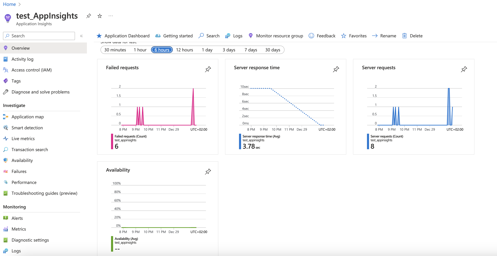
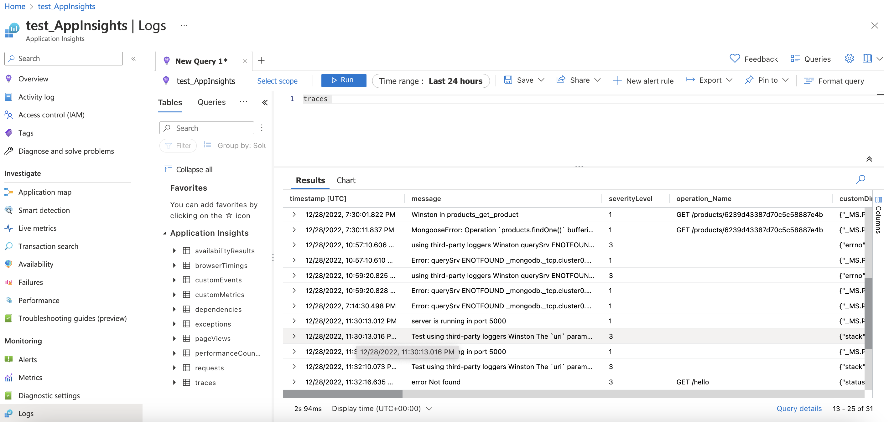

# POC for Monitor Node.js service with azure Application Insights


## Usage
 ```git clone``` it and thereafter run ```npm install``` then ```npm run start```

Make sure to also add your APPLICATIONINSIGHTS_CONNECTION_STRING, MONGO_URI and NODE_ENV to the .env file

```
APPLICATIONINSIGHTS_CONNECTION_STRING=""
MONGO_URI=""
NODE_ENV=""
```

## Screenshots


